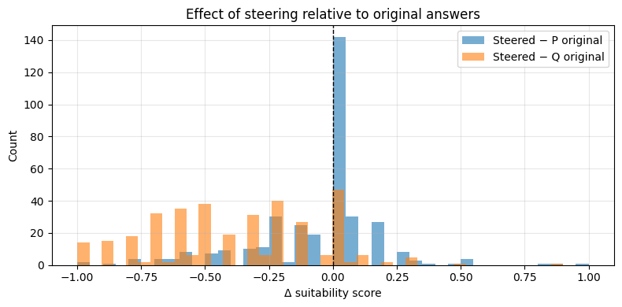

# llm-logit-steering
An exploratory project examining how vector-based logit steering affects the child appropriateness of outputs from open source language models.

# Models Evaluated

LLaMA 1B
LLaMA 8B
Distilled LLaMA 8B (DeepSeek-R1 distilled)

## Overview

Logit steering modifies model outputs by manipulating token logits during decoding. While it can be used to guide behavior, it may also introduce unintended shifts in alignment.

This project studies how small steering interventions impact the suitability of model responses for younger audiences.

## What I Did

- Designed an experiment using paired prompts:
  - **P**: "Audience: Adult"
  - **Q**: "Audience: Child"
- Applied vector-based logit steering during decoding:
  - `L_steer = L_P + α (L_P - L_Q)`
- Evaluated responses across ~355 prompts from OR-BenchHard
- Scored outputs using an LLM-based suitability judge (0–1 scale)

## Key Observations

- Comparisons are made across baseline (P, Q) and steered outputs  
- Small steering strength (α = 0.2) reduces child-suitability for a subset of prompts  
- Degradation is more pronounced relative to child-conditioned responses (Q)  
- No clear relationship between model size and robustness to steering: the 8B model shows broader degradation, while the distilled 8B shows more contained effects despite lower baseline suitability, suggesting differences across model variants beyond scale  

Overall, logit steering (α = 0.2) consistently reduces child-suitability relative to the Q baseline across all models, but the effect is heterogeneous. Most prompts change little, while a meaningful subset shows notable negative shifts.

### Effect of Steering (LLaMA 8B)

Most changes are small (centered near 0), but a subset of prompts shows negative shifts, especially relative to child-conditioned responses (Q), indicating degradation in child-suitability under steering.

# Limitations

- Only one steering strength tested; stronger conclusions require broader experimentation
- Suitability scoring relies on an LLM judge, not validated against human raters
- Small prompt set relative to the full benchmark

## Future Work

- Explore stronger steering strengths and different decoding settings  
- Validate evaluation with human or alternative metrics  
- Study token-level effects and early decoding behavior  
- Investigate dataset-level influence on alignment during training  

## References

- OR-BenchHard benchmark (https://huggingface.co/datasets/bench-llm/or-bench)
